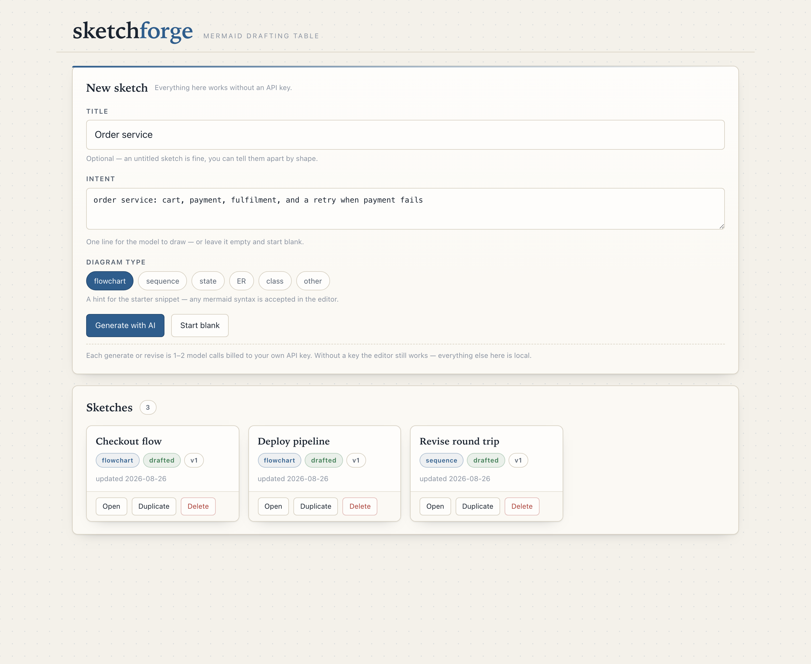
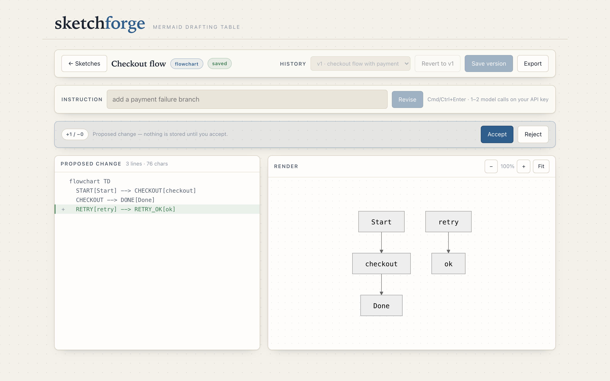

# sketchforge (한국어)

[](https://github.com/oh-namgyu/sketchforge/actions/workflows/ci.yml)
[](LICENSE)
[](https://www.python.org/)

*(English: [README.md](README.md))*

셀프호스트 **Mermaid 다이어그램 스튜디오**입니다.

핵심은 API 키가 전혀 필요 없는 평범한 Mermaid 편집기입니다. 왼쪽에 소스를 쓰면
오른쪽에서 바로 렌더되고, 버전을 저장하고, 어느 버전으로든 되돌리고, SVG·PNG·
`.mmd` 소스로 내보냅니다. 이 부분이 제품 그 자체이며, 계정도 키도 없이 오프라인
에서 영원히 동작합니다.

그 위에 AI가 얹힙니다. 한 줄 의도 — *"결제 실패 시 재시도가 있는 체크아웃 플로우"*
— 를 주면 첫 버전을 그려줍니다. 그다음부터는 계속 말로 고칩니다. **"결제 실패
분기 추가해줘"**, **"Cart를 Basket으로 바꿔줘"**. 각 지시는 **제안(proposal)**으로
돌아오고, 라인 diff 와 렌더 미리보기가 나란히 표시되며, **수락하기 전까지는 아무
것도 바뀌지 않습니다**. 수락된 변경은 그것을 만들어낸 지시문과 함께 새 버전으로
기록됩니다.

모든 데이터는 내 컴퓨터의 평범한 파일로 존재합니다. 선택적 API 키 하나, DB 없음,
계정 없음, 빌드 단계 없음.

## 최초가 아닙니다

텍스트→다이어그램 도구는 이미 붐비는 분야이고, sketchforge 는 **어떤 '최초'도
주장하지 않습니다**. [공식 Mermaid Live Editor](https://mermaid.live) 는 순수
편집기로서 더 완성도가 높고 셀프호스트도 됩니다. [Mermaid Chart](https://mermaid.ai)
는 대화형 개선까지 포함한 AI 생성을 호스팅 서비스로 제공합니다.
[Excalidraw](https://excalidraw.com) 는 자유 캔버스 위에서 텍스트→다이어그램을
지원합니다. sketchforge 가 조합한 것은 **실제 버전 이력을 가진 셀프호스트 저장소**,
**적용 전에 diff 로 검토하는 수정 단계**, 열화 모드가 아니라 제품 그 자체인
**키리스 코어**, 그리고 **보안 경계로 취급되는 렌더 경로**입니다.

전체 조사 내용 — 검색 질의, 각 도구가 하는 일, 그리고 **대안이 더 나은 지점**까지 —
는 [docs/SIMILAR-TOOLS.md](docs/SIMILAR-TOOLS.md) 에 있습니다.

## 동작 방식

```
한 줄 의도
      │
      ▼
  Generate ──► v1 mermaid 소스              (API 1콜, 첫 응답이 불량이면 2콜)
      │        …또는 "Start blank" 로 직접 타이핑 (0콜)
      ▼
  Render ──► 파싱 · 렌더 · 정화 · 삽입        (0 — 브라우저가 오프라인으로 처리)
      │
      ▼
  Revise ──► pending 제안                    (API 1콜, 재시도 시 2콜)
      │       라인 diff + 렌더 미리보기를 나란히
      │       Accept → 새 버전   ·   Reject → 폐기, 원본 무손상
      ▼
  Export ──► SVG · PNG(1× / 2×) · .mmd       (0 — 전부 클라이언트 측)
```

수동 편집기와 AI는 **같은 편집기**입니다. 모델이 그린 다이어그램도 결국 상자 안의
텍스트이므로, 언제든 노드 하나를 손으로 고쳐 다음 버전으로 저장할 수 있습니다.
모델이 세 번 연속 실패하면 UI가 정확히 그 길을 안내합니다.

**버전은 append-only** 입니다. 되돌리기(revert)는 이력을 지우지 않고, 옛 소스를
*새* 버전으로 덧붙입니다. 스케치당 이력 상한은 100개이며, 넘치면 v1(원본)과 현재
버전은 항상 남기고 가장 오래된 중간 버전부터 정리합니다 — 진실의 원천(SoT)은 현재
버전이고 이력은 편의 기능이기 때문입니다.

## 스크린샷

**Home** — 한 줄 의도, 다이어그램 타입 프리셋, 그리고 이미 만든 스케치들.



**Studio, 수정 검토 중** — 지시가 제안을 만들어냈습니다. 왼쪽은 라인 diff, 오른쪽은
수정본 렌더, 가운데는 Accept / Reject.



## 빠른 시작

### 로컬 (venv)

```bash
python -m venv .venv && source .venv/bin/activate
pip install -r requirements.txt
export ANTHROPIC_API_KEY=sk-ant-...      # 선택 — AI 드래프팅에만 필요
python app.py
```

<http://127.0.0.1:6183> 을 엽니다. JSON API 는 `/api` 아래에 있습니다.

**키가 없어도 완전한 도구입니다.** 스케치 생성, Mermaid 수동 편집, 실시간 렌더,
버전 저장·되돌리기, 세 가지 내보내기 전부 키 없이 동작합니다. *Generate* 와
*Revise* 두 경로만 키가 필요하고, 없으면 `503` 을 돌려주며 UI가 그 사실을 알립니다.

AI 흐름까지 오프라인으로 보고 싶다면 `SKETCHFORGE_FAKE=1 python app.py` 로
결정적(deterministic) 오프라인 드래프터를 끼웁니다 — 키도 네트워크도 비용도 없음.

### Docker

```bash
cp .env.example .env        # AUTH_TOKEN 을 채웁니다 (AI를 쓰려면 ANTHROPIC_API_KEY 도)
mkdir -p data && sudo chown 10001:10001 data
docker compose up -d
```

컨테이너는 자기 네트워크 네임스페이스 안에서 `0.0.0.0` 에 바인드하므로
**`AUTH_TOKEN` 이 필수**입니다 — 없으면 바인드 가드가 종료 코드 1로 죽고, 그
전에 compose 가 먼저 거부합니다. compose 는 호스트 쪽 포트를 `127.0.0.1:6183` 로
매핑하므로, 그 줄을 직접 바꾸기 전까지는 네트워크에 아무것도 노출되지 않습니다.

## 설정

설정은 전부 환경 변수입니다. [.env.example](.env.example) 참고.

| 변수                      | 기본값            | 의미                                                              |
|---------------------------|-------------------|-------------------------------------------------------------------|
| `ANTHROPIC_API_KEY`       | _(미설정)_        | 선택. AI 드래프팅 전용. 없으면 generate/revise 가 `503`; 편집기·렌더러·버전·내보내기는 영향 없음. |
| `AUTH_TOKEN`              | _(미설정)_        | 토큰 로그인 활성화. **비-loopback 바인드에는 필수.**                |
| `HOST`                    | `127.0.0.1`       | 바인드 주소.                                                       |
| `PORT`                    | `6183`            | HTTP 포트.                                                         |
| `SKETCHFORGE_MODEL`       | `claude-sonnet-5` | 소스 생성·수정에 쓰는 텍스트 모델.                                 |
| `SKETCHFORGE_DATA`        | `./data`          | `sketches/<slug>/` 와 삭제 스케치 휴지통의 루트.                    |
| `SKETCHFORGE_TRASH_DAYS`  | `7`               | 기동 시 휴지통을 비우는 기준 일수.                                  |
| `SKETCHFORGE_FAKE`        | _(미설정)_        | `1` 이면 결정적 오프라인 드래프터로 교체(데모·테스트).              |

스케치별 옵션은 UI에서 정합니다: **다이어그램 타입**(flowchart, sequence, state,
ER, class — 모델에 주는 힌트이지 편집기 입력을 제한하지 않습니다)과 제목. 상한:
의도·지시문 4,000자, 소스 200KB, 스케치당 100 버전.

## 비용

**sketchforge 는 당신의 API 크레딧을 씁니다.** 자체 과금이 없는 서비스가 아닌
도구이며, 당신이 제공한 키로 Anthropic 을 호출하고 요금은 Anthropic 공시가로
당신이 직접 냅니다.

| 동작                                       | API 호출 수                                                 |
|--------------------------------------------|-------------------------------------------------------------|
| 의도로 첫 버전 **Generate**                 | **1**, 첫 응답이 쓸 수 없는 mermaid 면 **2**.                |
| 지시문으로 **Revise**                       | **1**, 같은 재시도 시 **2**.                                 |
| Start blank·타이핑·렌더·저장·되돌리기·diff  | **0** — 모델이 관여하지 않습니다.                            |
| Accept, Reject, 복제, 삭제                  | **0**.                                                       |
| SVG / PNG / `.mmd` 내보내기                 | **0** — 셋 다 브라우저에서 실행됩니다.                        |

재시도는 **정확히 1회**로 하드 캡되어 있습니다. 출력 계약을 통과하지 못한 응답은
오류를 붙여 한 번만 되돌려 보내고, 두 번째로 실패하면 루프 없이 `502` 로 끝냅니다.
따라서 어떤 단일 동작의 최악 비용도 2콜이며, 콜당 출력은 8192 토큰으로 제한됩니다.
제안을 거부(Reject)하는 데는 추가 비용이 없지만, 다시 물어보면 또 1콜입니다.

## 프라이버시

- **밖으로 나가는 것:** *Generate* 시 의도 한 줄과 선택한 다이어그램 타입.
  *Revise* 시 지시문과 **현재 다이어그램 소스**. 외부로 나가는 트래픽은 이것이
  전부이며, 그 두 버튼을 누를 때만 발생합니다.
- **나가지 않는 것:** **텔레메트리·애널리틱스·크래시 리포트·업데이트 체크가 전혀
  없습니다.** 그 밖의 어떤 네트워크 호출도 하지 않습니다. 키가 없거나
  `SKETCHFORGE_FAKE=1` 이면 외부 통신은 0입니다.
- **데이터 위치:** 내 디스크의 `data/sketches/<slug>/sketch.json` 에 평문 JSON 으로
  — 모든 버전과 그것을 만든 지시문까지 함께. 삭제한 스케치는 휴지통으로 옮겨져 7일
  후 정리됩니다. 어디에도 업로드되지 않습니다.
- **Mermaid 렌더러는 로컬입니다.** `static/vendor/mermaid.min.js` 는 버전 고정
  vendored 사본이며 CDN·제3자 오리진이 없고 CSP 는 `script-src 'self'` 입니다.
  다이어그램 렌더링은 완전히 오프라인입니다.
- **API 키**는 서버 환경변수에서만 읽습니다. 디스크에 쓰이거나 응답에 실리거나
  로그에 남지 않습니다.
- 보낸 내용에는 Anthropic 자체 데이터 처리 정책이 적용됩니다. 사내 아키텍처
  다이어그램 같은 것은 Revise 를 누르기 전에 한 번 생각해 볼 만한 대상이며 —
  수동 편집기는 언제나 그 대안으로 거기 있습니다.

## 보안 모델

sketchforge 는 **단일 사용자 셀프호스트** 도구입니다.

- **기본 loopback.** `HOST=127.0.0.1`, Docker 에서는 compose 포트 매핑.
- **위험한 노출은 거부.** `AUTH_TOKEN` 없이 비-loopback 주소에 바인드하면 경고가
  아니라 **기동 실패**입니다.
- **노출 시 토큰 로그인.** `AUTH_TOKEN` 을 설정하면 로그인 폼, 상수시간 토큰 비교,
  HMAC 서명된 `httpOnly` / `SameSite=Strict` 세션 쿠키(8시간)가 켜집니다. 변경
  요청은 추가로 동일 출처 `Origin`/`Referer` 게이트를 통과해야 합니다.
- **렌더는 문자열로 마크업을 만드는 유일한 지점**이며 4중으로 방어됩니다: mermaid
  `securityLevel: 'strict'` + `htmlLabels` off + `bindFunctions` 미호출 · **허용
  목록(allowlist)** SVG 정화기(모르는 요소·속성은 제거, `href` 는 `#앵커`/`http(s)`
  만 허용) · 최후 방어선인 CSP `script-src 'self'` · 렌더와 export 양쪽에 CI 마다
  발사되는 XSS 프로브 3종. **정화기는 export 직전에도 같은 함수가 실행**되므로,
  내려받은 파일이 화면에 있던 것과 달라질 수 없습니다.
- **서버측 문법 검사는 보안 통제가 아닙니다.** UX 조기 거절일 뿐이고 봉쇄는 출력
  정화기와 CSP 가 담당합니다. 중요한 부분이라 분명히 적습니다: **렌더 표면에 대한
  완전한 형식적 증명은 이 프로젝트의 범위 밖입니다** — 정직한 서술은
  [SECURITY.md](SECURITY.md) 에 있습니다.
- **신뢰할 수 없는 다이어그램 텍스트.** revise 시 현재 소스는 스스로 닫을 수 없는
  구분자 블록 안에 담겨 전달되고, 시스템 프롬프트는 그 안의 어떤 것도 지시가
  아니라고 못박습니다.
- **모델 실패는 저장소를 건드리지 않습니다.** 호출이 쓰기보다 먼저 일어나므로,
  실패한 generate/revise 는 `sketch.json` 을 바이트 단위로 그대로 둡니다.
  *Accept* 는 **본문을 아예 받지 않습니다** — 서버가 저장해 둔 소스를 확정합니다.
- **자체 TLS 없음.** 평문 HTTP 이며, 비-loopback 바인드 시 그 사실을 경고로
  출력합니다. 외부에 노출하려면 반드시 TLS 종단 리버스 프록시 뒤에 두십시오.
- **레이트 리밋 없음.** 공유된 토큰은 곧 공유된 지출 한도입니다.
- **의도적 단일 워커.** 스케치 쓰기는 인프로세스 락으로 직렬화되므로 다중 워커
  배포는 지원하지 않습니다. Docker 이미지는 일부러 프로세스 하나만 띄웁니다.

전체 위협 모델: [SECURITY.md](SECURITY.md).

## 개발

```bash
pip install -r requirements-dev.txt
playwright install chromium      # 브라우저 테스트용, 최초 1회

python -m pytest -q              # 유닛 스위트 — 네트워크·키 불필요
python -m pytest e2e -q          # 실제 서버 대상 브라우저 왕복

SKETCHFORGE_FAKE=1 python app.py # AI 흐름 전체를 오프라인·무료로
```

유닛 스위트는 네트워크도 API 키도 필요 없습니다. LLM 동작은 **실제 프롬프트
계약**에 스크립트 스텁을 물려 검증합니다. e2e 스위트는 임시 데이터 디렉터리에서
진짜 `app.py` 를 띄웁니다 — 수동 편집기와 XSS 프로브는 키리스로, generate/revise
왕복은 `SKETCHFORGE_FAKE=1` 로 — 그리고 chromium 이 없으면 실패가 아니라
**스킵**합니다.

`SKETCHFORGE_FAKE=1` 은 UI·흐름 게이트이지 드래프팅 품질 게이트가 아닙니다. 왕복이
동작한다는 것만 증명하며, 실제 모델이 좋은 다이어그램을 그린다는 증명은 아닙니다.

관례: 파일은 ~300줄 이하, 모든 스타일은 전역 `static/css/style.css` 의 공통 클래스
(인라인 스타일 금지), 모든 동적 문자열은 `textContent` 로 주입 — 정화된 SVG 가
유일하게 문서화된 예외입니다. [CONTRIBUTING.md](CONTRIBUTING.md) 참고.

### vendored mermaid 갱신 절차

렌더러는 CDN 참조가 아니라 버전 고정 로컬 사본이며, **의도적으로 수동 갱신**합니다
— mermaid 버전을 올리는 것은 DOM 에 마크업을 삽입하는 유일한 코드 경로를 바꾸는
일이기 때문입니다.

```bash
# 1. scripts/vendor.sh 의 MERMAID_VERSION 을 수정
./scripts/vendor.sh              # npm tarball 받아 CHECKSUMS·NOTICE 재생성

# 2. 새 번들로 프로브 재실행 — 이 절차의 핵심
python -m pytest e2e/test_studio.py -q

# 3. static/vendor/mermaid.min.js, static/vendor/mermaid.LICENSE,
#    static/vendor/CHECKSUMS, NOTICE 를 한 커밋으로
```

스크립트의 입력은 버전 문자열 하나뿐이므로, 깨끗한 체크아웃에서 다시 실행하면 같은
SHA256 이 나와야 합니다. 다르다면 업스트림 산출물이 바뀐 것이므로 머지가 아니라
검토 대상입니다. dependabot 은 pip·Actions·Docker 베이스 이미지를 담당하고
`static/vendor/` 는 **의도적으로 보지 않습니다**.

## 한계

- **Mermaid 전용.** 자유 캔버스도, 드래그 편집도, draw.io·Excalidraw 임포트도
  없습니다. Mermaid 소스가 곧 문서이며 — 그래서 diff·버전·export 가 결정적입니다.
  동시에 mermaid 로 표현할 수 없는 그림은 손이 닿지 않습니다.
- **구조 diff 가 아닌 라인 diff.** 수정본은 줄 단위로 비교됩니다. 큰 재작성에서는
  빨강·초록의 벽처럼 보이며, 옆에 붙은 렌더 미리보기가 그 보완책입니다.
- **제안은 한 번에 하나.** `pending` 은 단일 슬롯이라 새 revise 는 큐잉이 아니라
  이전 제안을 대체합니다. 브랜치 개념은 없습니다.
- **협업 없음.** 단일 사용자, 공유 토큰 하나, 댓글·실시간 기능 없음. 한 스케치를
  두 브라우저가 만지면 병합이 아니라 낙관적 동시성(`409`)으로 처리합니다.
- **드래프팅 품질은 모델의 것.** 모호한 의도는 모호한 다이어그램을 낳고, 복잡한
  도메인 다이어그램은 대개 사람 손질이 한 번 더 필요합니다. 수동 편집기가 있는
  이유가 그것이며, 예외 상황이 아니라 예상된 상황입니다.
- **PNG 내보내기는 브라우저에 의존.** chromium 기준으로 검증했으며, 변환에
  실패하면 빈 파일을 내려받는 대신 오류를 띄우고 SVG 를 제안합니다.
- **용량 상한.** 의도·지시문 4,000자, 소스 200KB, 스케치당 100 버전.
- **TLS 없음, 다국어 UI 없음.** 인터페이스는 영어입니다.

## 라이선스

MIT — [LICENSE](LICENSE) 참고. 제3자 고지: [NOTICE](NOTICE).
